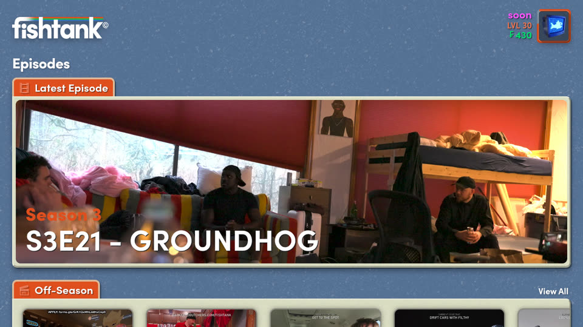
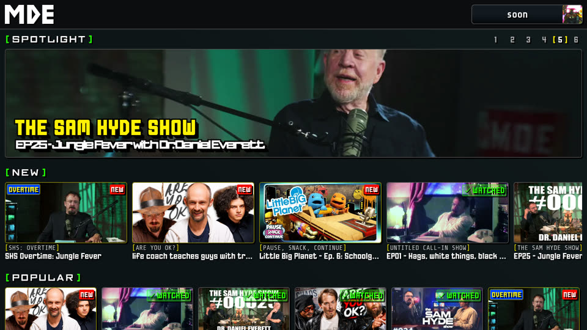
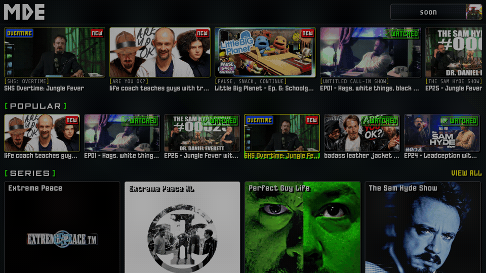

# fttv

Fire TV apps for **fishtank.live** and **mde.tv**.

built by [soon](https://x.com/emty_h3v) @ [fishtank.news](https://fishtank.news)

Unofficial. Not affiliated with, endorsed by, or supported by either site.

---

| | | |
|---|---|---|
|  | **Fishtank TV** — fishtank.live | [Download](https://github.com/michaety/fttv/releases/latest/download/fishtank-tv.apk) |
|  | **MDE TV** — mde.tv | [Download](https://github.com/michaety/fttv/releases/latest/download/mde-tv.apk) |

Install one or both. See [Installing](#installing) below for
how to sideload the APK on a Fire TV device.

<table>
<tr>
<td></td>
<td></td>
</tr>
</table>

### What they do

- **Remote navigation.** Arrow keys move a highlight around the page, Select
  activates it.
- **TV-appropriate layout.** The desktop site, not the phone one, so it's
  built for a wide screen.
- **Clutter removed.** Chat panels, nav bars, audio players and purchase
  prompts are hidden.

Navigating with the remote (MDE TV shown, same on Fishtank TV):

### What they don't do

These are websites in a wrapper, not native TV apps. **Expect some rough edges**:

- Navigation is approximate. Can be buggy.
- The Firestick is running a full desktop web app. **It is not fast.**
- Video player controls are locked to the remote. Play/pause, fast-forward and rewind buttons only. No scrubbing or play/pause with the arrows or select buttons.
- Anything the site changes on their end may break something here.
- Sign in with Google. See requirements below.

---

## Requirements

- A Fire TV Stick or Fire TV device. **This has only been tested on a Fire TV Stick 4K (2nd gen)**. Anything older than this may be unusable.
- An account on whichever site you're installing for — these apps don't
  create accounts or bypass anything
- **A password on that account.** Google sign-in does not work. If your account is Google-only, use "forgot
  password" on the site to set one first, then sign in with email and
  password on the TV. This won't disable you from logging in with Google elsewhere in future.

---

## Installing

First, enable Developer Options: Settings → My Fire TV → About, then click
your device name seven times.

**1. Allow app installs**

Settings → My Fire TV → Developer Options → Install Unknown Apps → enable it
for whichever app you'll install from (Downloader, or your file manager).

**2. Get the APK**

Download the latest release from the
[Releases](../../releases) page. Each release has two files:

- `fishtank-tv.apk`
- `mde-tv.apk`

**3. Install it**

Option 1: **[Downloader](https://www.amazon.com.au/AFTVnews-com-Downloader/dp/B01N0BP507?dplnkId=e9566ed7-f213-4ad2-89a4-d1566c14b1ee)**
app from the Amazon Appstore — enter the release URL (or go to this url), it downloads and prompts
to install.

Option 2: **[Apps2Fire](https://play.google.com/store/apps/details?id=mobi.koni.appstofiretv)**
pushes an APK from your Android phone over wifi. Install Apps2Fire, then the apks of your choosing and push the installs to your Firestick.

**4. Launch and sign in**

The app appears in your apps row. Open it, sign in with email and password,
and you're done.

---

## Remote controls

| Button | Does |
|---|---|
| **Arrows** | Navigation |
| **Select** | Selects |
| **Back** | Returns |
| **Play/Pause** | Play or pause the video |
| **Fast-forward** | Seek forward 10s |
| **Rewind** | Seek back 10s |

---

## Updating and maintenance

I created this selfishly so I could watch this content on my TV. Anything beyond an update that breaks the app I will not be maintaining.

---

## Notes

These apps display websites you already have accounts for. They don't
circumvent payment, DRM, or access controls, and they don't collect anything —
there's no analytics, no telemetry, and no server involved beyond the sites
themselves.
